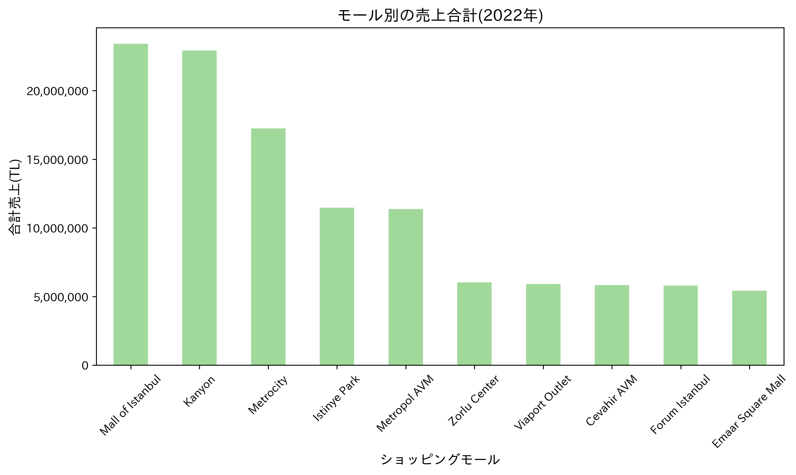
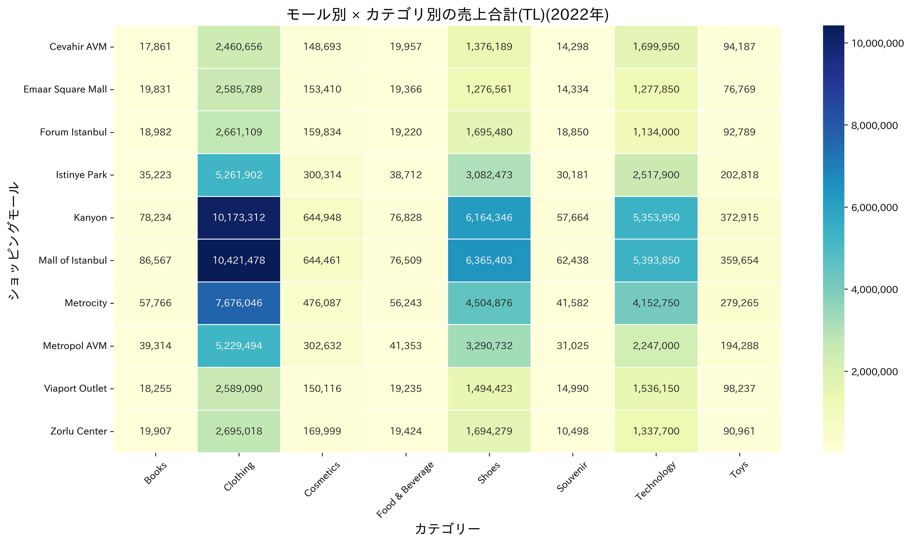

# Retail Sales Analysis 2022（イスタンブール小売データ分析）

このプロジェクトは、イスタンブールの10のショッピングモールにおける2022年の購買データをもとに、小売動向を可視化・分析することを目的としています。  
顧客属性・カテゴリ・決済手段・時間帯などの多様な軸から傾向を明らかにし、マーケティングや店舗戦略に役立つインサイトを抽出しました。

---

## ・ 使用データ

- **データセット名**：Customer Shopping Dataset - Retail Sales Data  
- **提供元**：Kaggle  
- **URL**：[https://www.kaggle.com/datasets/berkayalan/retail-sales-data](https://www.kaggle.com/datasets/mehmettahiraslan/customer-shopping-dataset/data)
- **対象期間**：2021年〜2023年（本プロジェクトでは2022年に絞って分析）

※ Kaggleからのデータ利用規約により、本リポジトリにはデータファイル（CSV）は含まれていません。必要に応じて上記リンクから取得してください。

---

## ・ 構成ファイル

| ファイル名 | 内容 |
|------------|------|
| `script/01_retail_sales_2022_analysis.ipynb` | データ読み込み・整形・集計準備 |
| `script/02_payment_analysis.ipynb` | 決済手段別の売上・件数集計と可視化 |
| `script/03_mall_trends.ipynb` | モール別・カテゴリ別の傾向分析（ヒートマップ含む） |
| `script/04_time_series.ipynb` | 月・曜日・季節による時間軸傾向分析 |
| `script/05_category_deepdive.ipynb` | カテゴリ × 年代・性別の深掘り分析 |
| `script/06_summary.ipynb` | 分析まとめと主要グラフの再掲 |

---

## ・ 出力グラフ例

`output/` フォルダ内に、分析から得られた主要グラフをPNG形式で保存・掲載しています。
以下抜粋

 
 
 
 
 
 

---

## ・ 使用環境・ライブラリ

- OS：Windows 11
- 開発環境：Jupyter Notebook（Anaconda）
- 使用ライブラリ：
  - pandas
  - matplotlib

---

## ・ 補足

- `.gitignore` により `data/` ディレクトリは除外されています（元データはKaggleにて取得をお願いします）。

---

## ・ ライセンス・利用について

このリポジトリはポートフォリオ目的で公開しています。商用利用・転載の際はご連絡ください。
